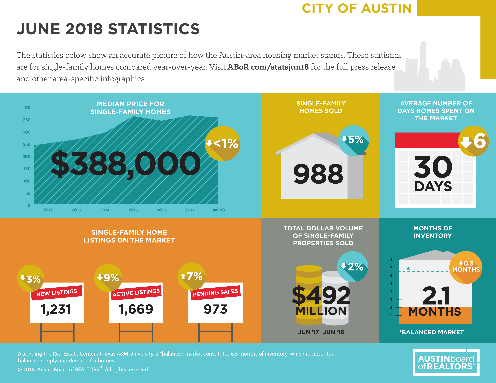
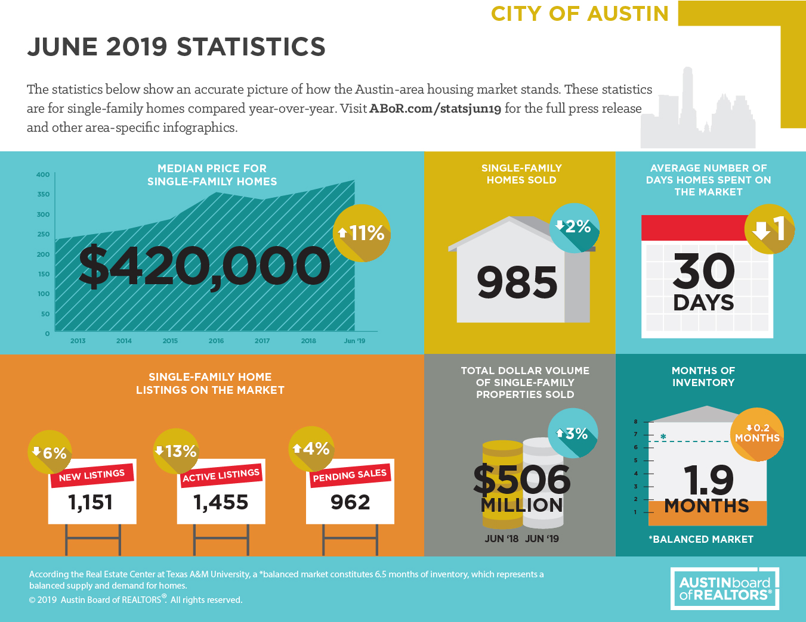
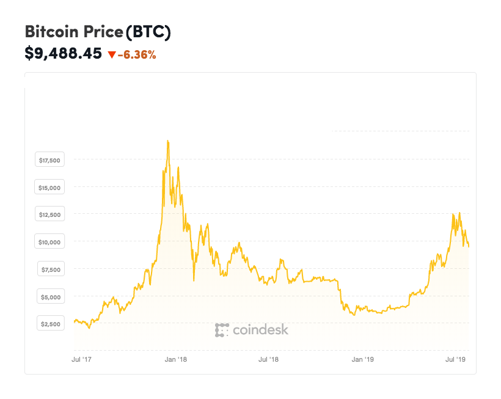

## Buying a home is a _huge_ decision.

I've been saving up for one, just like everyone else is in Austin. The market is growing like crazy, and everyone wants to jump onboard.

It makes sense. Compare these two graphics comparing central Austin homes.

So yes, it looks like buying a home is a good idea. But consider this: **just because an asset price is rising does not mean it's a good investment.**

Let's look at Bitcoin. Its price was rising like crazy, and some people did buy while it was rising. A large portion probably made money, but a few were caught at the peak around $20,000 😅. Bitcoin is currently trading around $9,000.

_Disclaimer: I know housing is waaaay less volotile than cryptocurrency, this is just an example._

#### The money

I looked around at a few differrent calculators trying to figure out if it was a good financial decision. There's lots of things you have to take into account.

- Interest rate
- Down payment amount
- Closing costs and fees
- Private Mortgage insurance (PMI)
- Taxes
- Insurance
- Home Owners Association fees (HOA)
- Maintinance costs

#### Lifestyle impact

Theres a few other lifestyle questions to ask yourself as well.

- Is this going to change your commute?
- Are you willing to get a roommate?
- Are you willing to Airbnb your house?

#### Risk tolerance

You also need to figure out your risk tolerance. Do you have:

- a stable job?
- good medical insurance?
- six months of expenses saved? (your downpayment does not count)
- a backup plan?

#### The upside

It's important to measure the value a house adds to your life when making this decision.

- Did you gain space?
- Did you have a backyard now?
- Is the market likely to appreciate in the next 12 months?

## Complicated, but not complex

There are a lot of questions to answer, but once you have them answered your decision should be straightforward. I couldn't find any tools outside of mortgage calculators to help me make this decision.

That's why I started building [ShouldIBuyThis.House](https://ShouldIBuyThis.House).

### My goal

Most of my content on this site has promoted building small, functional products and iterating quickly.

<blockquote class="twitter-tweet">
  

    New rule:  
     
    Build a basic version in 1-2 weekends. Put it out there.
     
     
    Applies to features, products, blog posts — anything really.  
     
    Inspired by <a href="https://twitter.com/shl?ref_src=twsrc%5Etfw">@shl</a> and{' '}
    <a href="https://twitter.com/levelsio?ref_src=twsrc%5Etfw">@levelsio</a>.{' '}
    <a href="https://twitter.com/hashtag/sideproject?src=hash&amp;ref_src=twsrc%5Etfw">#sideproject</a>{' '}
    <a href="https://twitter.com/hashtag/IndieHackers?src=hash&amp;ref_src=twsrc%5Etfw">#IndieHackers</a>
  

  &mdash; Drew Bredvick (@DBredvick){' '}
  <a href="https://twitter.com/DBredvick/status/1152682809460494337?ref_src=twsrc%5Etfw">July 20, 2019</a>
</blockquote>

I'm setting a two week deadline from today to finish this project.

ShouldIBuyThis.House will ask you a some of these questions. Answer each question with your best guess. Then, it will provide you a reccomendation on whether you should buy or not. Easily export your results and share them with your partner, financial adviser, or realtor.

### What's next?

I have a long list of features to add to the site. The first priority is account support so you can save your results. Have any suggestions on what I should include in the site? Hit me up using the [contact page](/contact) on this site.
