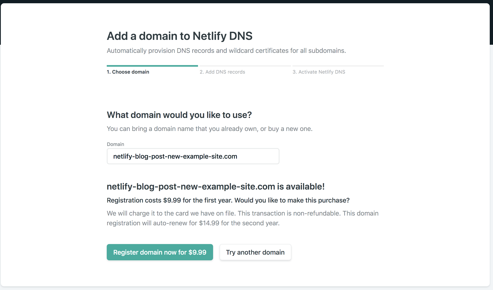
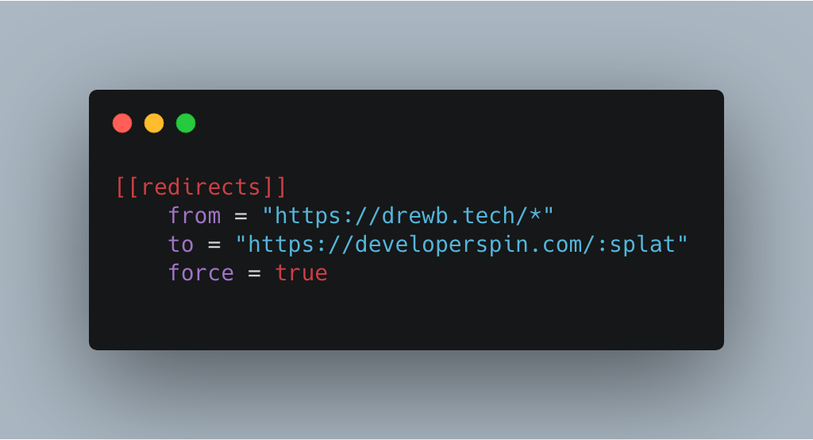
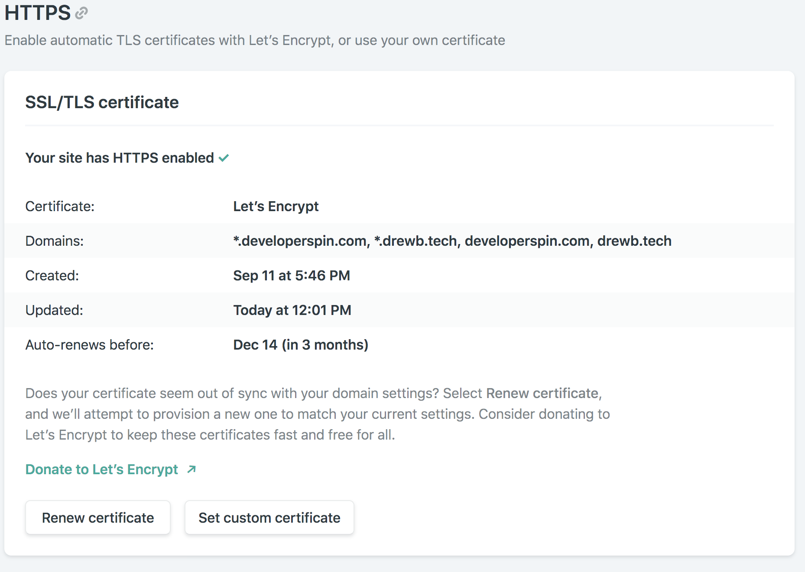

I buy _waaaaayyy_ too many domains. Once you start buying them, it's pretty hard to stop. Each new great (or so I think) idea deserves a parking spot on the web. Domains aren't that expensive -- only about \$10 dollars a year. I spend more than that on a couple of cups of coffee.

> What if someone comes up with the same idea and buys the domain first? - Me, at 3AM

I initially thought [https://drewb.tech](https://drewb.tech) was an excellent spot to park my blog. I named it "Tech Stuff" and moved on to writing content. Turns out "Tech Stuff" isn't that great of a name. It also didn't cover the broad list of topics I talk about. _Soooo..._

## I bought another domain.

My new domain, [developerspin.com](https://developerspin.com), has a better ring to it. It also has branding potential, and I could probably come up with a pretty sick logo (with the help of my creative girlfriend). I picked it up on [Netlify](https://netlify.com) for \$9.99 for the first year.

## Time to switch over domains

Typically, dealing with all these domain DNS settings is a pain. Usually, you have to set a bunch of records on your DNS host and hope you're doing things the right way.

With Netlify, this is all much simpler.

### Buy the new domain

I highly recommend buying your domain on Netlify. Yes, it might be a bit more expensive in the long haul, but everything _just works_. Head on over to the **Domains** tab on Netlify and search for the domain you want. I generally browse domains on [domains.google.com](https://domains.google.com) and then buy it on Netlify after I've found the one I want.

  

### Change site settings

Go to the new site that you want to change, add the domain alias in the **Settings** tab under **Domain Management**. After you've done that, click **Set as primary domain**.

### Adding forwarding rules

This part is important. If you don't do this, your traffic **WILL NOT** be forwarded to the new domain. Adding 301 redirects is also super important for SEO. Google needs to know that your site changed domains; otherwise, you lose all your SEO hard work. On Netlify, you can set [redirect rules](https://www.netlify.com/docs/redirects/) in a couple of ways. I recommend the `netlify.toml` approach. Add the following section to the file:

### HTTPS

Let's face it; every site needs HTTPS. Netlify by default ships with free wildcard certificates using [Let's Encrypt](https://letsencrypt.org), which makes life very simple for us. After switching domains, you only need to click the **Renew certificate** button. It's that easy.

### Test it out

Wait a few minutes (about 15 max), open up a few different browsers, and check to make sure that both HTTPS and the redirects are working. Congrats on moving domains!

## Having problems?

Follow me on Twitter and send me a Tweet or DM and I'll help you out.

<a
  href="https://twitter.com/intent/tweet?screen_name=dbredvick&ref_src=twsrc%5Etfw"
  class="twitter-mention-button"
  data-show-count="false"
>
  Tweet to @dbredvick
</a>
