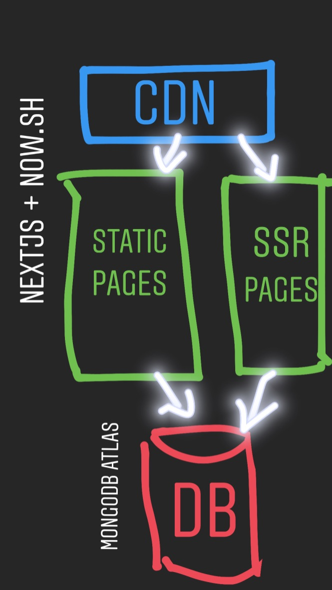

# Thought Experiment

We are going to start a business together, and we need to pick our tech stack. We need to choose something that will support our company for the time in which it is operating. Our goal is to build a successful product, gain users, and become profitable.

## Overview

1. Understand the business goals
2. Understand the product goals
3. Analyze your team's strengths
4. Design initial architecture
5. Pick your tech stack

We're going to dive into each of these areas, but here's the TLDR (for me);

- React for front end
- NodeJS for APIs (deployed as serverless func)
- Using [NextJS](https://nextjs.org) Framework
- Hosted on [Vercel](https://vercel.com/home)
- MongoDB database on [MongoDB Atlas](https://cloud.mongodb.com)

## Businesses

Let's take a look at some statistics before we start making decisions.

Only 30% of U.S. small businesses make it to the ten-year point, according to the Bureau of Labor Statistics.

Here's the [entrepreneurship ](https://www.bls.gov/bdm/entrepreneurship/bdm_chart3.htm) if you're interested.

That means there's a **really** big chance of us failing.

Why is that important? Well, it will keep things light when we get into arguments over framework abc vs framework xyz. At the end of the day, there's a 70% chance what we pick doesn't even matter.

## What are we building?

We're going to build a tool for developers to track their habits. Let's assume we are going to start with a web app, but might venture into native apps in the future. We will need a front end for the website, likely static or server-side rendered for SEO considerations. We will need to build a back end API to support our app. Hosting and devops needs to be simple to manage.

## Tech Requirements

- We don't need our code to be "trendy," we need it to work.
- We need to be able to hire developers to work in our codebase.
- We need to optimize for developer velocity so we can get a lot done with minimal resources

## Strengths

### I'm good with JavaScript.

This is the most important part of building startups - pick something you're comfortable with. You need to rely on your strengths.

### I'm a full-stack developer.

Being full-stack will help a lot in the early days when our resources are limited. Later on, we will want to hire experts in different areas of the app to help it scale. For now, we want to move quickly and try to get product-market fit as soon as possible.

## Initial Architecture

Here’s my best take at diagraming architecture using Instagram stories.

## Tech Decisions

### React

- I'm experienced in React. We will need to lean into our strengths as founders to bootstrap this thing to success. (developer velocity)
- It has large amounts of community support (check out this [Google Trends](https://trends.google.com/trends/explore?date=2013-09-10%202019-10-10&geo=US&q=%2Fm%2F012l1vxv,sveltejs,vuejs) comparison)
- React is the [3rd most relied on npm package](https://www.npmjs.com/browse/depended). There is a significant incentive for everyone, not just Facebook, to maintain it.
- Frameworks like NextJS, GatsbyJS, and others are being built on top of React and make development a breeze.
- We will be able to hire React developers for at least the next five years.

### NodeJS

- I have experience with NodeJS and Express.
- We are already using JavaScript, so this minimizes context switching.
- Package reuse between front end and back end

### NextJS

We need a way to server-side render our React app. You can do this [without a framework](https://medium.com/spreetail-engineering/approaching-server-side-rendering-in-an-existing-react-redux-application-2c403819a231), but NextJS gives you a lot of nice things out of the box.

- Routing
- Code splitting
- SSR
- Static exporting
- Pre-fetching
- TypeScript support
- Caching
- and plenty more

### Vercel

If you're using NextJS and want to move quickly, Now is the only hosting answer. Now is ran by the same team that made NextJS, so there are lots of great built-in features that make hosting simple.

- Zero config
- Per-branch environments
- Free SSL config
- CI/CD
- CDN

_Disclaimer: I am not saying that everyone should use React._

## Conclusion

I'm making these tech decisions because they are right _for me_. There is no one-size-fits-all approach that will work. The important thing is to know your goals for the project, understand your strengths, and optimize for _your_ developer velocity.
