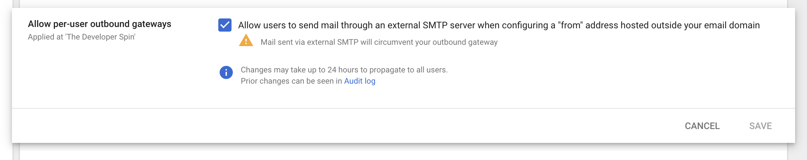

# Sending email with Zeit.co Domains

In order to send emails with a custom domain, we need to:

1. Buy the domain
2. Purchase email hosting
3. Configure DNS records on the domain

We will focus on steps two and three in this post. This post assumes you are using a domain purchased through Zeit.co and have `now` CLI access configured.

### You might be asking yourself:

> Why can't we just use Zeit (or other domain provider) for emails? Do I really need to pay more money?

The answer is yes, you do need to buy hosting. Namecheap actually has a [pretty good description](https://www.namecheap.com/hosting/what-is-email-hosting/) of why you need email hosting. Think of it as the same thing as website hosting, except for your emails.

### Enter GSuite

GSuite is an _alright_ product for sending emails from custom domains. To be clear, this tool is geared at enterprise businesses, so the UX leaves something to be desired.

#### Step One

Sign up for [GSuite](https://gsuite.google.com/) 💰💸

#### Step Two

Confirm you own the domain.

In GSuite admin, go to [Manage Domains](https://admin.google.com/AdminHome?hl=en#Domains:). Click _Add A Domain or Domain Alias_.

To verify you own the domain, you will need to set a TXT record on your domain's DNS settings.

With Zeit's `now`, it looks like the following:

List out your domains

```
now dns ls

```

Using Google's verification code, run the following command

```
now dns add YOURDOMAINHERE.com @ TXT YOURGOOGLEVERIFICATIONSTRINGHERE
```

Press _Validate_ in GSuite and Google will try to confirm you own the domain. It may take some time before this works, be patient.

#### Step Three

Setup MX records.

After you prove you own the domain, it's time to start forwarding along emails to Google.

This is also done via DNS records on your domain. Run each of these in your CLI.

```
now dns add YOURDOMAINHERE.com @ MX ASPMX.L.GOOGLE.COM 1
now dns add YOURDOMAINHERE.com @ MX ALT1.ASPMX.L.GOOGLE.COM 5
now dns add YOURDOMAINHERE.com @ MX ALT2.ASPMX.L.GOOGLE.COM 5
now dns add YOURDOMAINHERE.com @ MX ALT3.ASPMX.L.GOOGLE.COM 10
now dns add YOURDOMAINHERE.com @ MX ALT4.ASPMX.L.GOOGLE.COM 10
```

Verify the MX records with GSuite.

#### Step Four

Configure Gmail and GSuite.

Now, head over to Gmail.

Click on the settings gear, Accounts, and then "Add another email address".

Enter in your new email and select "Treat as an alias".

You may see the error:

> Functionality not enabled.
> You must send emails through YOURDOMAINHERE.com SMTP servers when you send as you@YOURDOMAINHERE.com. However, this functionality is not available for your account. Please contact your domain administrator for more information.

To fix this error, hop over to the Gmail settings in GSuite for [End User Access](https://admin.google.com/ac/apps/gmail/enduseraccess?hl=en) and enable "Allow per-user outbound gateways".



Wait a few minutes and add the email address again in Gmail to resolve this issue.

## Happy Emailing

If you want to test out your new email, send me an email from your new account at `drew@developerspin.com`.
