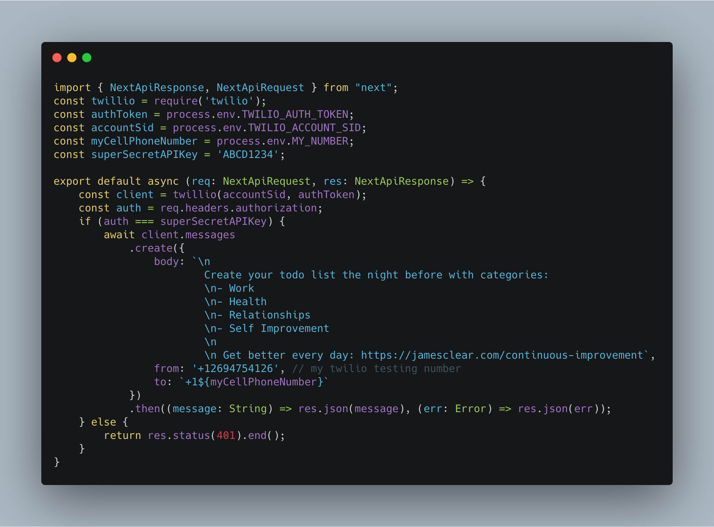
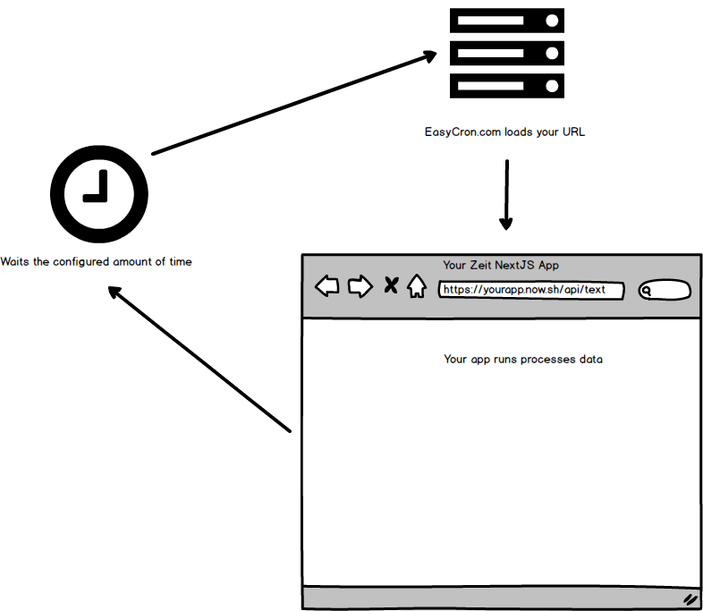
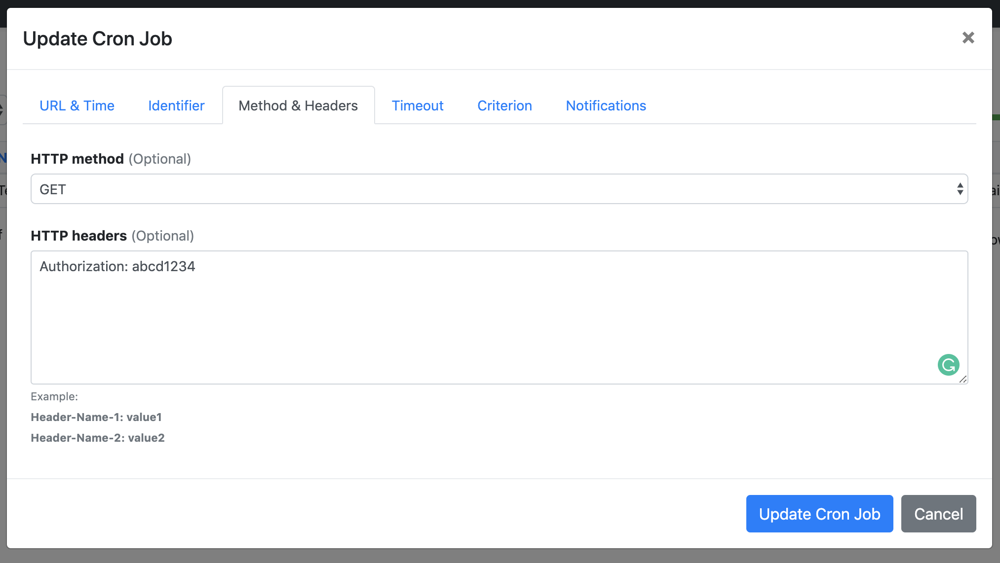

### I want to remind myself of my New Year's resolution every day via text.

Why? None of those productivity apps have ever worked for me. I don't open them. I want to be reminded in an app I use every day, iMessage. Let's solve this with cron jobs, a Twilio API call, and Zeit hosting.

Lot's of apps use cron jobs. In the past, I've setup [cron jobs on linux](https://opensource.com/article/17/11/how-use-cron-linux) servers to process orders, send notification emails, and run expensive SQL queries. Think of it as a list of tasks your server needs to run and the frequency to run them. It's pretty simple to setup and is even shipped with Mac OS & Linux (check out `crontab`).

#### Want a text reminder of your New Year's goals but don't want to run the code yourself?

I'll setup daily text reminders, pay the Twilio fees, and pay hosting costs for the first 10 people who retweet this tweet and DM me 🙂

  <blockquote class="twitter-tweet">
I created an automatic text to remind myself of my New Year&#39;s resolutions each morning.  It&#39;s a simple NextJS app deployed on Zeit that uses <a href="https://twitter.com/EasyCron?ref_src=twsrc%5Etfw">@EasyCron</a> to hit Twilio every day.   What do you want to remind yourself of everyday?<a href="https://t.co/enzxJU89DA">https://t.co/enzxJU89DA</a>
&mdash; Drew Bredvick (@DBredvick) <a href="https://twitter.com/DBredvick/status/1216176087207682056?ref_src=twsrc%5Etfw">January 12, 2020</a></blockquote>

> But how do we run cron jobs in Zeit Now deploys? - You, right now, in your Google query

There are five quick steps you need to run cron jobs in a Zeit NextJS app.

## 1. Start your project

To create a quick NextJS project, I used `create-next-app` mentioned in the [NextJS docs](https://github.com/zeit/next.js#quick-start).

You'll want to make sure you have:

- a `pages` folder
- an `api` folder inside the `pages` folder

## 2. Add your logic

Then, make sure you have a `/pages/api/text.js` (or do it in TypeScript for bonus points 😎).

_Note: there's no need to follow the rest of this step, unless you're building a resolution reminder app just like me._

Here's what mine looks like:

If you're going to use TypeScript, follow the [NextJS guide](https://nextjs.org/blog/next-9#built-in-zero-config-typescript-support) to converting the initial project to TS.

Here's the link to the example code: [text.ts](https://gist.github.com/dbredvick/602e398b61ac960e326fdd45dab67f3d). You will need to install the following packages as well: [package.json](https://gist.github.com/dbredvick/f2beb92070789b662849b8dc82092c21).

## 3. Add some security & deploy

Every project needs a little security. For this project, let's make sure our API route is requiring some auth. See the part where we are checking for `superSecretAPIKey`? You should come up with your own secret and save it for later. We're going to be using that in step number five.

To deploy to Now, follow [this guide](https://zeit.co/docs#installing-now-cli) to deploy with the CLI.

## 4. Create a cron job

This isn't truly going to be a cron job. We're going to be using [EasyCron.com](https://easycron.com?ref=156527). They have a free tier that's sufficient if you're fine with not adding security (you can't change headers in their free plan).

Here's what we are trying to achieve:

## 5. Finish the security (optional)

Like I said, every app needs some security. In order to be secure with [EasyCron](https://easycron.com?ref=156527), I recommend adding authorization headers to your HTTP call from within the UI.

Add an `Authorization` header to your call with the following:

This is adding some security, but is not the best option. If you need to _really_ secure your endpoint, I would recommend different approaches.

## And that's it!

Congrats, you setup cron jobs inside of a serverless NextJS app hosted with Zeit. Please let me know if you ran into any problems!

<a href="https://twitter.com/DBredvick?ref_src=twsrc%5Etfw" class="twitter-follow-button" data-show-count="true">Follow @DBredvick</a>

Good luck on those resolutions  💪💯
