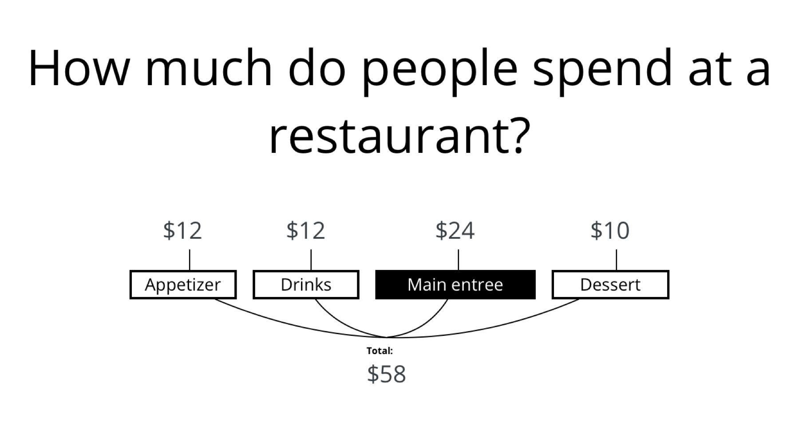
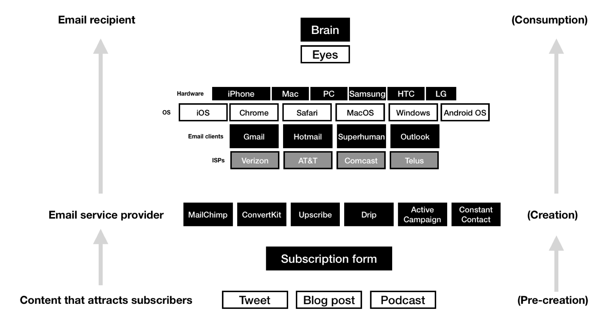
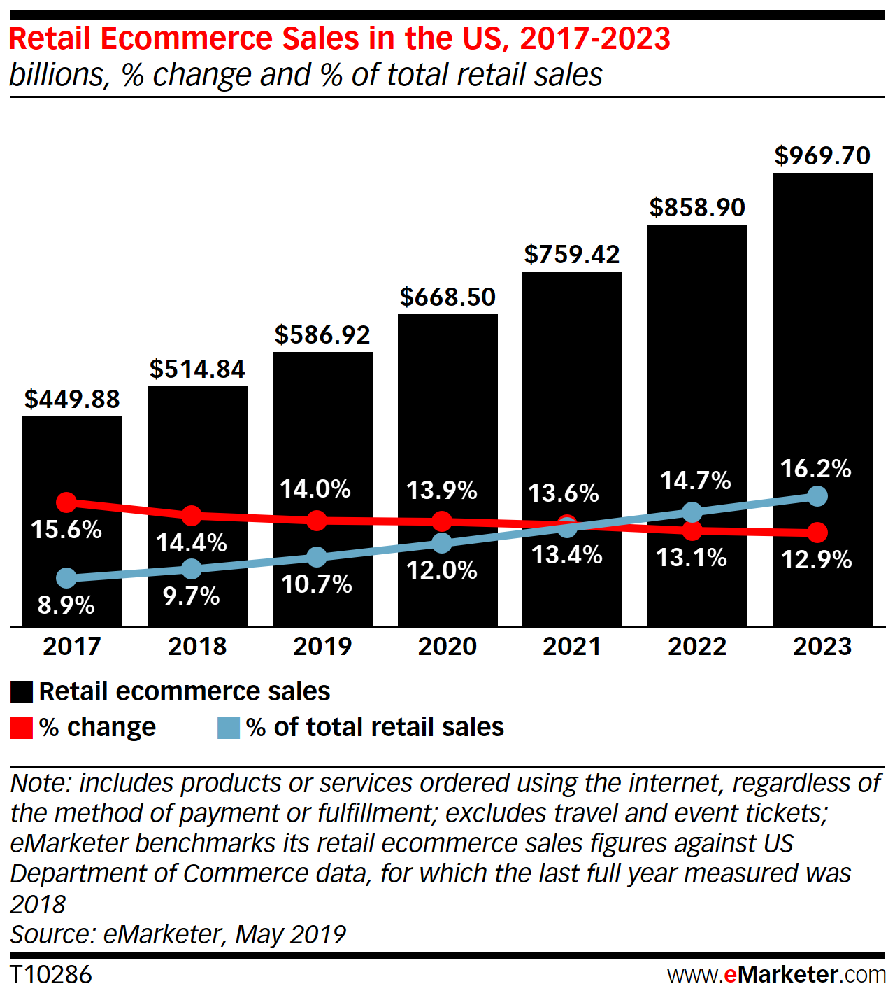

Knowing what _not_ to work on is as hard as knowing what you _should_ work on.

Tim Ferriss has a (somewhat outdated) [list](https://tim.blog/2007/08/16/the-not-to-do-list-9-habits-to-stop-now/) written back in 2007.

> “Not-to-do” lists are often more effective than to-do lists for upgrading performance.

Allison Rimm wrote about this in [an article](https://hbr.org/2018/03/taming-the-epic-to-do-list) in Harvard Business Review.

She maintains three lists of tasks:

1. are important, non-time-sensitive
2. need to be completed today
3. aren't worth the time

Any item thats on list number three Allison intentionally skips.

## "Not-to-do" list for building products

Most individual builders have rules about products they won't build. Some have rules about avoiding products with long sales cycles, others have rules about avoiding business-to-consumer (B2C) products.

Below are a few points from makers about what not to build.

### Don't build an appetizer

Justin Jackson of TransistorFM argues that you should try to be ["the main thing"](https://justinjackson.ca/the-main-thing) or "the entree".

Most people order the entree when they go out to dinner and it's often where restaurants make most of their profit.

In the product world, this translates to:

- generally avoid addons (unless the market supports it)
- don't niche-down too much 
- provide the bulk of the value

The counter-intuitive point here is that sometimes that means taking on more scope, building a bigger project, and writing more code. It's advice that runs against most of the "start small" and "niche down" logic.

It's all about analyzing the value chain of the market you serve:

I highly recommend reading all of Justin's post [here](https://justinjackson.ca/the-main-thing?ref=drew.tech).

#### Takeaways

- Don't build an appetizer or dessert (unless the market is large)
- Pick a market with momentum
- Pick parts of the value chain that are good for indie makers

---

### Don't build for the wrong market

Sahil Lavingia took Gumroad from a weekend project to a venture-backed startup. The growth rate wasn't enough to raise the next round. Check out his journey below:

  <blockquote class="twitter-tweet" data-conversation="none" data-theme="dark">
    

      (Gumroad is growing faster now than it was back then)
       
       
      “It doesn’t matter how amazing your product is, or how fast you ship features.
      The market you’re in will determine most of your growth.”<a href="https://t.co/TbMuCmKL2c">
        https://t.co/TbMuCmKL2c
      </a>
    

    &mdash; Sahil Lavingia (@shl) <a href="https://twitter.com/shl/status/1207333860268077058?ref_src=twsrc%5Etfw">December 18, 2019</a>
  </blockquote>

Similar to Justin's advice above, the market your in matters.

### Examples 
If you're building ecommerce software: Good news - ecommerce is growing.

Making podcasting tools or services? Interest is at an all time high and continues to grow.

#### Takeaways
- pick a market that's growing
- don't assume you will grow faster than the market
- not all business models require venture capital

---

### Don't build something for other people

This one is my personal rule. Your mileage may vary. I have been working on a side project for a few months now and have been building it without being a user of the tool. 

That doesn't work for me.

#### Quicker Questions

[Quicker Questions](https://quickerquestions.com/) was fun to initially work on.
I had started at a new company and the Q&A sessions were not efficient. I was very excited to fix this problem.

I wanted to get up and running quickly, so I used [Divjoy](https://divjoy.com/?via=drew), a ReactJS project generator.

<a href="https://divjoy.com/?via=drew">
  </img>
</a>

Divjoy helped me go from zero to accepting payments in a few days. The problem wasn't the tech, it was **product-market-founder** fit.

When considering HR software, question and presentation software is somewhat ancillary.

Generally, most of the HR software budget will be spent on payroll or recruiting.

Quicker Questions in its current state is not a useful addon to a growing market.

Sli.do, the winner in the space, has seen more and more competition recently. Google even unveiled a tool to do Q&A inside of Google Slides.

Companies change software like this infrequently, meaning growth in this market is heavily tied to the growth of new companies.

#### Takeaways
- Personally, I need to build a tool that *I want*
- Use tech that helps you ship quickly

## Conclusion

- I need to create something I wish existed in the world 
- It needs to be the main thing
- It should map clearly to a job to be done

## Questions for you

1. What are you building? 
2. What should I build?
3. What products do you refuse to build?

I'd love to hear what you think on Twitter ([@dbredvick](https://twitter.com/DBredvick)) or [IndieHackers](https://www.indiehackers.com/dbredvick).