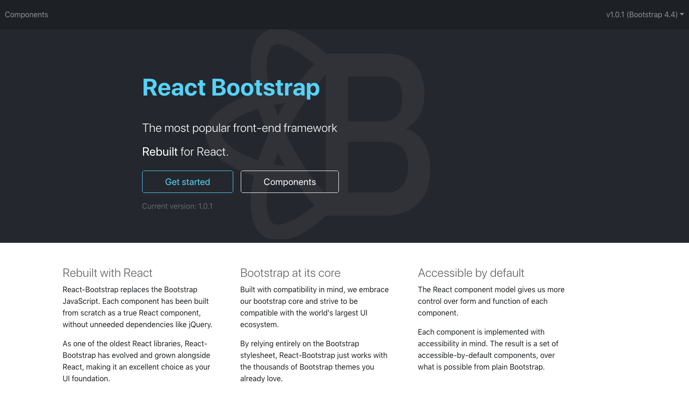
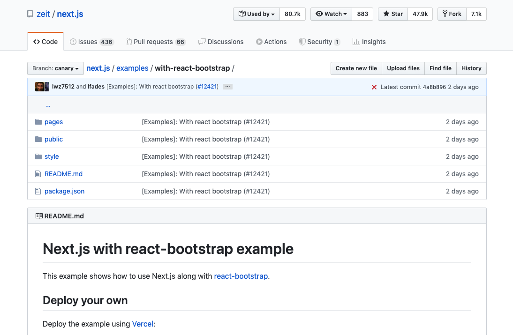
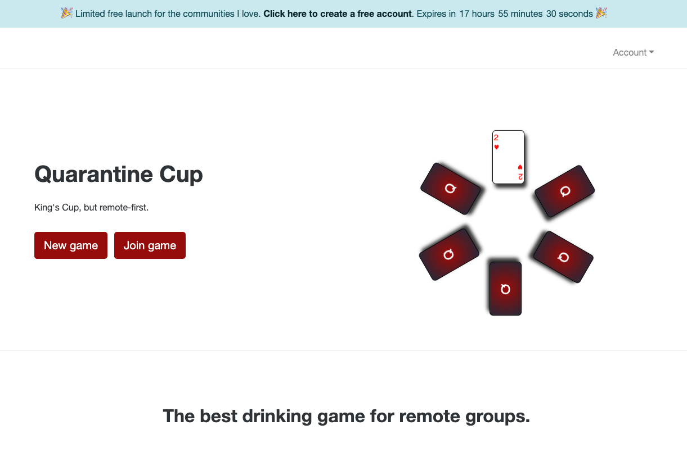
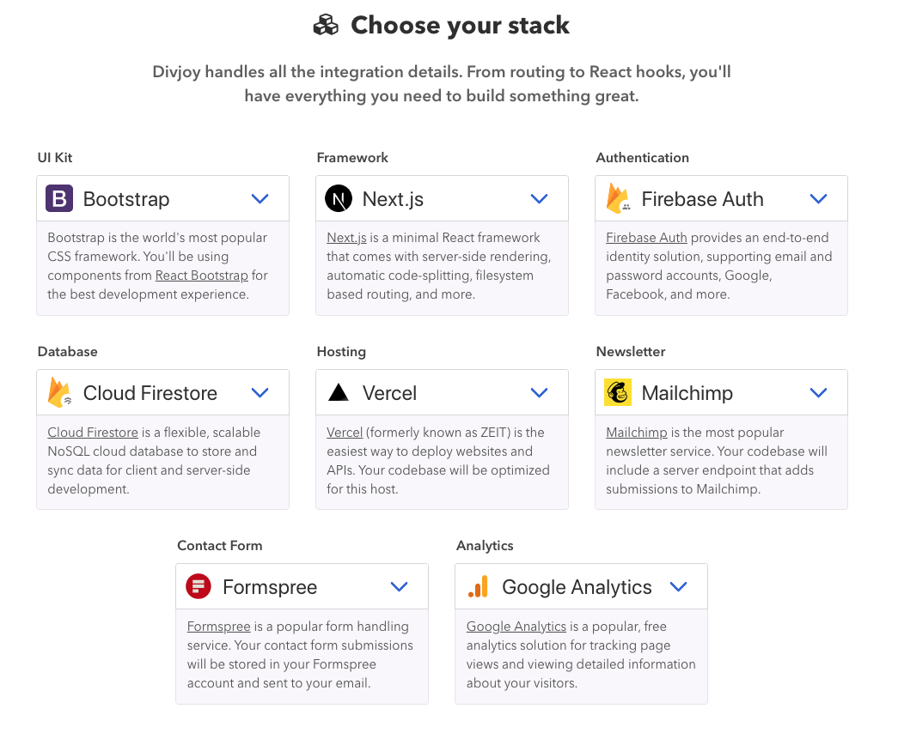
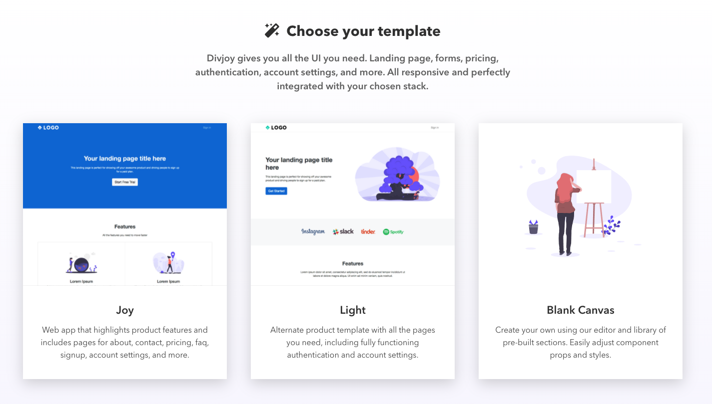

It's three in the morning. You woke up with the next great startup idea. You hop on Namecheap and buy the domain. As you fall back asleep you're excited to break code on the project tomorrow.

You wake up early, brew some coffee, and crack open VS Code. Today is the day.

With a fresh cup of coffee in hand, you crank out the data models. After creating some awesome draw.io diagrams, you have a good idea of how you want to architect this system. It's not perfect. That's okay.

Next you decided to take on figuring out the component library.

You're considering:

- [Ant](https://ant.design/docs/react/introduce)
- [Chakra UI](https://chakra-ui.com/)
- Buying [TailwindUI](https://tailwindui.com/)
- [Bulma](https://bulma.io/)
- or [React Bootstrap](https://react-bootstrap.github.io/)

All of these libraries are pretty great. It takes you the rest of the morning to decide between them.

_Side note: we're blessed to have so many great UI library options._

After thinking about component choices over lunch, you decide to go with the devil you know - React Bootstrap.

Next you've got to decide where to put all this front end code. By trade you are a React developer. Because you're focused on iterating on the product, you pick tech you already know.

You're considering:

- [Create React App](https://github.com/facebook/create-react-app)
- [NextJS](https://nextjs.org/)
- [GatsbyJS](https://www.gatsbyjs.org/)

Because of your familiarity with NextJS you decide to use it for this project. A hybrid server-side-rendered (SSR) & statically built site is perfect for your dashboards and marketing pages.

You decide to go take a look at Vercel's NextJS [starter for React Bootstrap](https://github.com/zeit/next.js/tree/canary/examples/with-react-bootstrap):

---

You've spent tons of time figuring out your tech stack. Your CI/CD is ready to go and you've nailed your font choice.

> There's only one problem - you aren't motivated to work on this project anymore.

## We've all been there.

As developers, this is the loop we get stuck in.

`START;`
- What should the domain name be?
- What component library should I use?
- Where should I deploy this?
- How do I handle auth?
- Wait do I need a database now?
- Why isn't this fun anymore?

`goto START;`

The goal is to avoid that loop (as well as using `goto` statements).

We get stuck making technical decisions instead of doing important work. By spending all of this time trying to get our tech just right we miss out on:

- customer interviews
- market research
- financial models
- competitive analysis

and tons of other things that are required to build a successful product.

In order to build a side project we need to ruthlessly prioritize.

<blockquote class="twitter-tweet">
What are the biggest obstacles to bootstrapping to ~$1k MRR?
&mdash; Earnest Capital (@earnestcapital) <a href="https://twitter.com/earnestcapital/status/1254095006803152896?ref_src=twsrc%5Etfw">April 25, 2020</a></blockquote>

<blockquote class="twitter-tweet">
  

    mmhmm. i often say that 50% of an entrepreneurs job is just prioritizing and
    working on the most high leverage thing within time/bandwidth constraints.
    super hard when still working full-time. have to ruthlessly prioritize.
  

  &mdash; Earnest Capital (@earnestcapital){" "}
  <a href="https://twitter.com/earnestcapital/status/1254102258721177602?ref_src=twsrc%5Etfw">
    April 25, 2020
  </a>
</blockquote>

<blockquote class="twitter-tweet">
Time
&mdash; Flavio Amiel ⭕ (@fba) <a href="https://twitter.com/fba/status/1254110195707449344?ref_src=twsrc%5Etfw">April 25, 2020</a></blockquote>

<blockquote class="twitter-tweet">
perseverance  aka losing motivation  aka running out of energy before you gain fresh motivation
&mdash; fred rivett 👨🏻‍💻 (@fredrivett) <a href="https://twitter.com/fredrivett/status/1254109652733829121?ref_src=twsrc%5Etfw">April 25, 2020</a></blockquote>

## So what's the solution?

**Use a scaffolding tool.**

Use something that helps you build faster, make quicker decisions, and start iterating on your product *now* - not in two more weeks after "nailing the tech".

### Enter Divjoy

[Divjoy](https://divjoy.com/?via=drew) is a React generator built by Gabe Ragland ([@gabe_ragland](https://twitter.com/gabe_ragland)). I've used it on a few of my last side projects and really enjoyed it. It perfectly addresses a lot of the issues we're dealing with as busy IndieHackers making products on the weekends.

>"Use our easy web-based tool to create the perfect codebase for your next project."

Divjoy helped me build and launch [Quarantine Cup](https://quarantinecup.live/?q=blog) in less than a month while still working a full-time job.

_[Quarantine Cup](https://quarantinecup.live/?q=blog) is the best new remote drinking game for this quarantine season_

#### Pick your tech
Instead of spending _tons_ of time researching tech, pick from an existing set of options in the dropdowns.

#### Pick your theme
Instead of debating how the UI of your landing page should look, use one of the existing options as a starting point.

#### Start coding
Divjoy creates high quality ReactJS code that is very easy to jump into. The code follows consistent patterns that make it easy to keep you components organized. Most components are fairly composable and can be reused throughout the site.

#### Save time
I've saved **a ton** of time using Divjoy. Below are my estimates of how long it would take me to do basic tasks with and without Divjoy:

| Item   |      Without Divjoy      |  With Divjoy |
|----------|:-------------:|------:|
| Adding Auth |  6 hrs | 10 mins|
| Configuring React-Bootstrap |    1 hr   |   0 mins|
| Creating landing page | 6 hrs |    1 hr |
| Configuring DB | 3 hrs |    10 mins |
| Adding a newsletter | 2 hrs |    10 mins |
| Adding analytics | 1 hr |    10 mins |
| Contact us page | 3 hrs |    10 mins |
| **Total**| **28 hrs** |    **1 hr 50 mins** |

### Is it worth it?

Right now Divjoy is priced at $59. Divjoy is clearly worth it on a single project basis, but it's priced for _unlimited_ code export for a year. This makes it a bargain in my opinion.

#### Pros
**The code quality is great.** There are a few times the generated code reminds me to be a good developer and follow the solid established patterns in the existing code.

**You can build quickly.** Divjoy helps keep "quick weekend projects" on time and stops them from stretching multiple months long.

**Time is money.** If you value your time at more than $2 an hour, Divjoy is well worth the money simply because it gives you time back.

**Great support.** The founder has been super responsive on Twitter and has responded to all of my feedback. It's been great to watch Gabe improve the product each release.

#### Cons

**Right now, Divjoy is only for React projects.** If you're not a React developer, this product is not for you. I don't recommend Divjoy as a way to learn React either, as it gives you so many things out of the box that you should probably learn from other avenues.

**Divjoy doesn't have third party library support.** I would love to use TailwindUI in the Divjoy UI, but that's hard to support since TailwindUI is a private project. I would really like to figure out better ways to do paid private UI libraries.

**AWS Amplify is missing.** I would like to see [AWS Amplify](https://aws.amazon.com/amplify/) for hosting and authentication in the future.

#### Overall
[Divjoy](https://divjoy.com/?via=drew) will be a core piece of all of my new projects going forward. I may not use the UI for every project, but the reusable auth, database, and email logic are worth the price by themselves. 

## Get started

If you're interested in hearing more about Divjoy, I'm down to chat. Tweet at me [@dbredvick](https://twitter.com/dbredvick).

Check out Divjoy at [https://divjoy.com](https://divjoy.com/?via=drew).

I'm sure both Gabe ([@gabe_ragland](https://twitter.com/gabe_ragland)) & the official Divjoy ([@divjoy](https://twitter.com/divjoy)) account are down to chat as well.