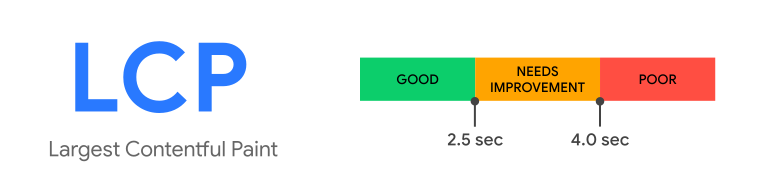

## Web Vitals

A paradigm shift is here for performance monitoring.

Google introduced Web Vitals earlier this May which, ushering in the era of Real User Monitoring ([RUM](https://en.wikipedia.org/wiki/Real_user_monitoring)) for the front end.

Google's <a target="_blank" href="https://web.dev/vitals">web.dev/vitals</a> page says it best:

"Web Vitals is an initiative by Google to provide unified guidance for quality signals that are essential to delivering a great user experience on the web."

## Why introduce new metrics?

When compared to previous performance metrics, Core Web Vitals provide more accurate data, encourage alignment between teams, and enable better performance analytics.

### Accuracy

Currently, a lot of organizations measure performance with a mixture of these options:

- Install an application performance monitoring (APM) tool (back end & real-time)
- Audit a few key pages with manual or automated Lighthouse tooling (front end & scheduled)
- Audit changes to Lighthouse at the pull request step (front end & during CI)
- Install a browser APM tool (front end & real-time)

The best solutions rely on real user data.

Core Web Vitals encourage using **field data** instead of **lab data**.

Instead of measuring performance in an isolated environment with your CI process, you're measuring it out in the wild with your real customers on their devices.

With lab data, your scores are precise but not necessarily accurate.

Field data tends to be more accurate and precise.

**Real users are sending you real performance data.**

### Alignment

In any organization, one of the hardest tasks can be aligning all of the different teams and departments.

With the introduction of Core Web Vitals, Google is helping align teams across multiple domains:

- SEO / marketing
- Engineering
- Design / UX

Web Vitals are "unified guidance" from Google.

This means to improve your SEO, meet best technical practices, and provide a good user experience your Web Vitals must be a priority.

If you've ever had a meeting trying to determine which metrics your team should track, you understand how difficult selecting good metrics can be.

**Marketing, engineering, and design will all be on the same page**.

### Realtime Analytics

Most Lighthouse SaaS tools work by auditing a certain set of pages every so often. 
If you're trying to keep your bill lower, you might even opt for scanning once a day.
<!---
// scans scaling daily compared to amount of traffic
-->
While these periodic scans are useful, occasional snapshots can be lacking when digging for the root cause of a new performance issue.

Web Vitals are different – they are **realtime**.

Each visitor to your site reports their performance data as they browse. This stream of data builds a more complete picture of your performance in the field.

With realtime data, we can:

- shorten developer feedback loop on performance
- alert teams when they slow or break the site 
- debug performance issues on a granular level 

With the addition of realtime data, the front end APM world will borrow many features from existing back end APM solutions.

**Realtime data can power realtime alerting.** 

## How are Web Vitals collected?

Core Web Vitals are measured in the field. Google collects this data via the <a href="https://developers.google.com/web/tools/chrome-user-experience-report" target="_blank">Chrome User Experience Report</a>.

You might even be contributing to Core Web Vitals.

If you:

- use Chrome
- sync your browser history
- don't have a sync passphrase
- and have usage statistic reporting enabled

you're contributing to Google's data set.

### Core Web Vitals

Core Web Vitals are a subset of Web Vitals. This smaller group includes Largest Contentful Paint (LCP), Cumulative Layout Shift (CLS), and First Input Delay (FID).

To be considered a Core Web Vital, a metric must:

- be [user-centric](https://web.dev/user-centric-performance-metrics/#how-metrics-are-measured)
- be measured on a real user's device
- not overlap with other Core Web Vitals

### Cumulative Layout Shift (CLS)

Cumulative Layout Shift measures visual stability.

"Does this page jump around?"

### Largest Contentful Paint (LCP)

Largest Contentful paint measures the load time of the largest block of text or image in the viewport.

"Does the biggest thing on the screen load quickly?"

### First Input Delay (FID)

First Input Delay measures how quickly your site responds to user input.

"Does this page respond when I click it?"

These descriptions are very brief. If you'd like more info, I made a more in-depth guide that covers each Core Web Vital specifically.

**Visit <a href="https://vitals.guide" target="_blank">vitals.guide</a>**.

## Conclusion

We're in the early innings of the change Core Web Vitals will bring to the web.

Every user will be represented in your performance data.

The tooling to alert and fix performance degradations will massively improve.

The SEO, engineering, product, and design teams will all be focused on the same problem: **improving the user experience**.

---

## FAQ

Here is a list of the most common questions I get about Core Web Vitals:

### Do Core Web Vitals affect my SEO?

Technically, not yet. Google has said in a <a target="_blank" href="https://webmasters.googleblog.com/2020/05/evaluating-page-experience.html">blog post</a> that they won't change the Search algorithm until sometime in 2021 and will provide at least six months of warning.

There is some nuance to this answer, though. FCP and FID have clear parallels to metrics used in the current Search ranking algorithm.

By improving your FCP and FID, you will likely improve your Total Blocking Time (TBT) and First Contentful Paint (FCP).

### Can I still use Lighthouse?

Yes, but Lighthouse audits should not be your only source of performance data. Lighthouse is a **lab** tool. Ideally, you would be tracking performance from **field** data as well.

See the "Accuracy" section above for a deeper explanation.

### How can I see my Core Web Vitals?

- Page audits (Lighthouse and PageSpeed Insights)
- A Chrome extension
- Google Search Console
- Manual tracking

I wrote up a guide on [how to track Web Vitals](https://vitals.guide/tracking-core-web-vitals).

### Where's the best place to learn about Core Web Vitals?

Google has created a ton of great content around Web Vitals. The site <a href="https://web.dev/vitals" target="_blank">web.dev/vitals</a> is crammed full of useful information on what Vitals are, how you can measure them, and how to improve them.

Because most of Google's content stays higher-level, I created <a href="https://vitals.guide" target="_blank">vitals.guide</a> as a practical guide to Web Vitals.

I'll be exploring Web Vitals more and building tools to assist developers in monitoring them. Follow me on [Twitter](https://twitter.com/dbredvick) or sign up below to hear more. 