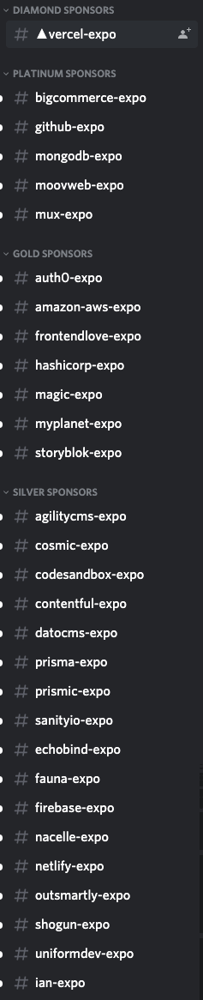

I attended Next.js Conf last month and was impressed by the high quality content, updates, and virtual conference setup (yay global pandemics).

It even inspired me to build a new product, [Next.js Jobs](https://jobs.nextjsnotes.com) – but more on that below.

## The content, updates, and setup

The production level of this conference was _waay_ better than I was anticipating.
The keynote along with each of the individual presentations showed a level of polish while still feeling like a conference talk.
I think this was accomplished by pre-recording talks, but requiring a "one-take" policy, meaning the video had to be recorded in one sitting with no edits.

Next.js 10 is great, and so are its accompanying features from Vercel. Check out my post on the [highlights of Next.js Conf](https://nextjsnotes.com/next-js-conf-highlights-2020/) over on NextjsNotes.com.

All of this happened on an awesome YouTube-powered live streaming conference setup with multiple "stages". Cool stuff.

### The community

But what I was mostly impressed with was the **community**.

Tons of people registered, over 75k. And about half of them actually showed up!

I joined the community Discord server and was overwhelmed by the volume of channels and messages.

Check out just how many "job" channels there were:

By the way, you can totally still join the Discord if you're interested: [https://discord.gg/KNKF84E](https://discord.gg/KNKF84E)

## The realization

And then after the conference, all of those extra job channels got cleaned up.
That left me thinking, where are all these job posts going to go?
I searched around, but there was really home for them.

Current job boards barely treat Next.js as a first class citizen, but rather emphasize React.
That's probably fine for most cases for the hiring mangers, as a good React dev can be taught Next.js.

> But what about the developers looking for Next.js jobs?

There's not much outside of the single "#jobs" channel in the Discord now, which is very noisy. It's full of job seekers trying to find a job that uses Next.js.

## The product

That's why I created Next.js Jobs – a job board for Next.js enthusiasts. A job board that helps developers find their Next(.js) job.

  

### How does it work?

If you're looking for a job:

1. [Sign up](https://jobs.nextjsnotes.com/) with your email
2. Companies submit jobs that use Next.js
3. I manually moderate the job post and make sure they actually use Next.js
4. Each Tuesday, an automated email goes out with links to each job and their descriptions

If you're submitting a job:

1. [Submit a job](https://jobs.nextjsnotes.com/submit-a-job) on the site
2. I'll moderate it and reach out to you with any questions
3. If approved, your job post will be sent out to developers the following Tuesday morning

### The future

There are _a lot_ of missing features right now, but rather than build them, I want to validate there is actually market demand here.
So test it out, let me know what you think!

I'm not planning on monetizing this until it's a self-sustainable platform. Right now I'm manually finding Next.js jobs and adding them to the site. In the future, I hope to charge about **\$99/mo** for a job posting. Well under what LinkedIn is asking, and generally in line with what I've seen in terms of "standard pricing" for job boards.

---

If you want to keep up with all things Next.js, head over to my newsletter at [NextjsNotes.com](https://nextjsnotes.com/#/portal/signup) and sign up.

See you on the other side,

Drew
