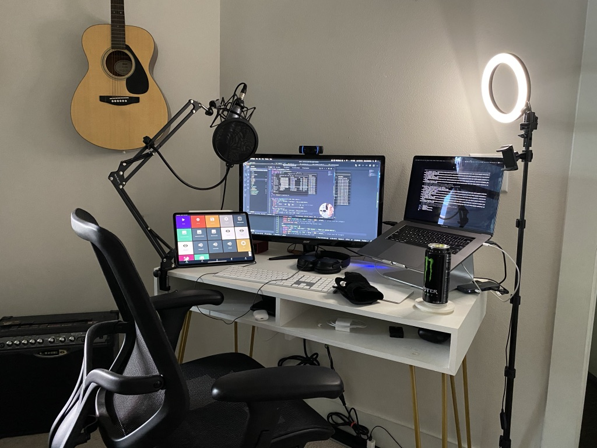

## Hi, I'm Drew.

I build products and write about web dev, building and marketing SaaS, and the books I’m reading.

Right now, I'm building with **Next.js**, **Vercel**, **AWS Amplify**, and **TailwindCSS**.

I love the intersection of marketing and software development and topics like:

- analytics
- SEO
- lifecycle emails
- content marketing
- performance monitoring

and more.

Right now, I'm digging deep on [Core Web Vitals](https://drew.tech/the-ripple-of-web-vitals) & their impact on SEO.

### I write a little bit.

This blog has existed for quite some time, though under various domain names.

Some of my favorite posts are:

- [The ripple of Web Vitals](/the-ripple-of-web-vitals)
- [Rome wasn't built in a day](/rome-wasn't-built-in-a-day-and-neither-was-my-saas-app)

I recently decided to start a separate site for my Next.js content at [NextjsNotes.com](https://nextjsnotes.com/).

I'm in the process of recording tutorial videos to accompany my Next.js and Core Web Vital content.

### I'm building Fit Vitals.

I'm convinced [Core Web Vitals](https://web.dev/vitals/) are a big deal. I wrote an entire [article](/the-ripple-of-web-vitals/) on why Vitals provide more accuracy, alignment for teams, and more actionable analytics. DM me [on Twitter]()

[Fit Vitals](https://fitvitals.dev) is a SaaS application aimed at helping search engine optimizers and engineers monitor, alert, and improve their Core Web Vitals.

### I live in Austin.

My beautiful fiancée and I moved to Texas a little over two years ago.

The weather is great, the breakfast tacos as tasty, and no one judges me for over using "y'all" 🤠

### I tweet.

I probably spend too much time on Twitter, but it's a great place to document my journey to running a profitable SaaS.

You can follow my journey [@DBredvick](https://twitter.com/dbredvick) or sign up below for emails.

To get ahold of me, either DM me on Twitter or email me at drewb@hey.com.

See you on the other side,

Drew
